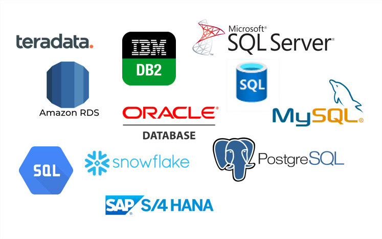

# Hands-on Flask-05 : Handling SQL with Flask Web Application

Purpose of the this hands-on training is to give the students introductory knowledge of how to handle forms, how to connect to database and how to use sql within Flask web application on Amazon Linux 2023 EC2 instance. 



## Learning Outcomes

At the end of the this hands-on training, students will be able to;

- install Python and Flask framework on Amazon Linux 2023 EC2 instance.

- build a web application with Python Flask framework.

- handle forms using the flask-wtf module.

- configure connection to the `sqlite` database.

- configure connection to the `MySQL` database.

- work with a database using the SQL within Flask application.

- use git repo to manage the application versioning.

- run the web application on AWS EC2 instance using the GitHub repo as codebase.

## Students are expected to 

- Examine and run the `app-with-sqlite.py` 

- Create `app-with-mysql.py` at same folder and  configure the same application according to RDS MYSQL database. 

## Outline

- Part 1 - Run the  Sample Web Application with SQLite and database implementation

- Part 2 - Write same application with MySQL

- Part 3 - Install Python and Flask framework on Amazon Linux 2023 EC2 Instance using RDS


## Part 1 - Examine and Run the Sample Web Application with SQLite and database implementation in your Local

- Examine which module are imported for this project 

- Examine the anatomy of the `Database` configuration of `app-with-sqlite.py`

```
- It adds required environmental variables for SQLite  according to documentation    
   https://flask-sqlalchemy.palletsprojects.com/en/2.x/config/

- It drops users table if exists, creates new users table and adds some rows for sample

- It Executes sql commands to  commit data to tables

```

- Examine the anatomy of the `Functions`  determined in `app-with-sqlite.py`

```
- Function named `find_emails` which find emails using keyword from the user table in the db,
 and returns result as tuples `(name, email)`.

- Function named `insert_email` which adds new email to users table the db.
```

- Examine the anatomy of  the `Decorators `  determined in `app-with-sqlite.py`

```
- Function named `emails`  finds email addresses by keyword using `GET` and `POST` methods,
uses template files named `emails.html` given under `templates` folder
and it assigns to the static route of ('/')

- Function named `add_email` inserts new email to the database using `GET` and `POST` methods,
uses template files named `add-email.html` given under `templates` folder and  it assign to the static route of ('add')

- The Flask application  can be reached from any host on port 8080.
```

- Be sure that you install `flask-mysql, sqlalchemy, Flask-SQLAlchemy` via  `sudo pip3 install `

- Run the  application `app-with-sqlite.py` 

- Check the database tables via SQLite Browser ( You can download the SQLite Browser from the link : 
https://sqlitebrowser.org/)


## Part 2 - Write same application with MySQL and run on in your Local

- Create an RDS database with following configurations: 

```
- Engine option         : MySQL
- Version               : 8.0.35
- Template              : Free tier
- DB instance class     : db.t2.micro
- Publicly accessible   : ***Yes
- Master username       : admin
- Master password       : Clarusway_1
-Initial DB name        : clarusway

```
- Create `app-with-mysql.py` the  same folder near the `app-with-sqlite.py` 

- Configure the same application according to RDS MYSQL database rather than SQLite

- Check the documentation for environment variable

(https://flask-mysql.readthedocs.io/en/stable/)

- commit your code and push it to your GitHub repo

- Launch an Instance and pull your files in to it


## Part 3 - Install Python and Flask framework on Amazon Linux 2023 EC2 Instance 

- Launch an Amazon EC2 instance using the Amazon Linux 2023 AMI with security group allowing SSH (Port 22) and HTTP (Port 8080) connections.

- Connect to your instance with SSH.

- Update the installed packages and package cache on your instance.

- Install `Python 3` and `pip3` packages.

- Check the python3  and `pip3` version

- !!!!! Since you may get error from the last version of flask , Install `Python 3 Flask (pip install Flask==2.3.3)` framework while working on EC2

- Install `flask_mysql`.

- Run application with Python


